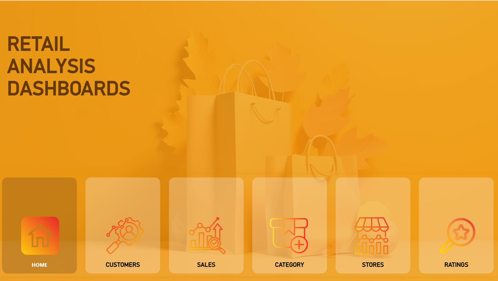
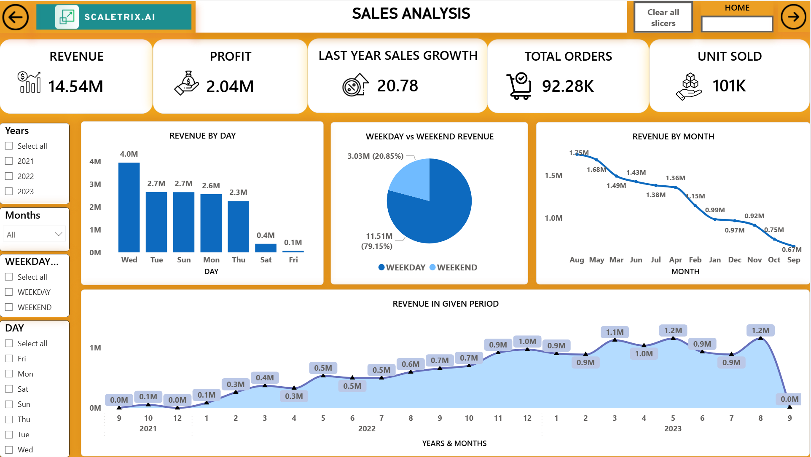
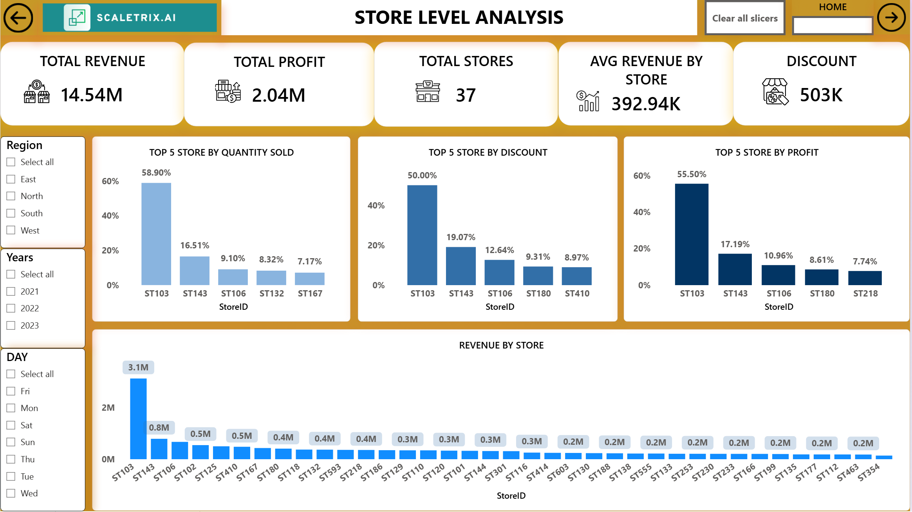
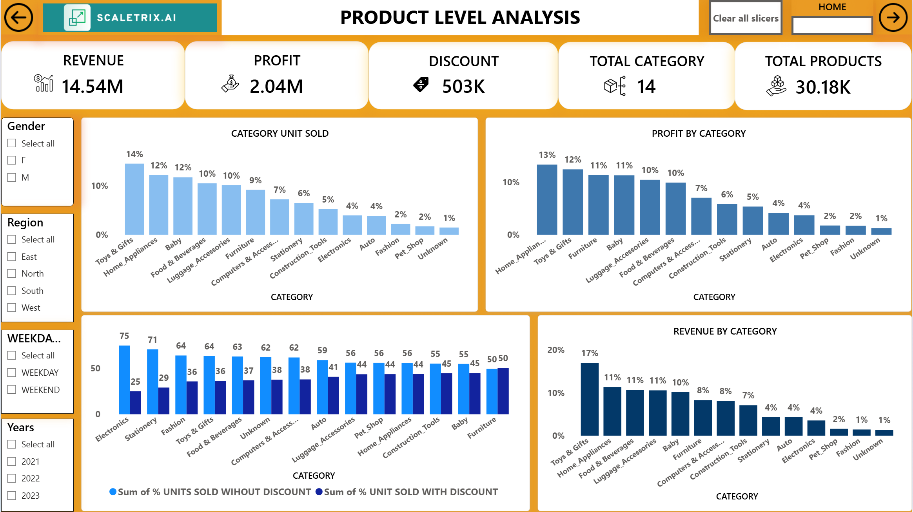
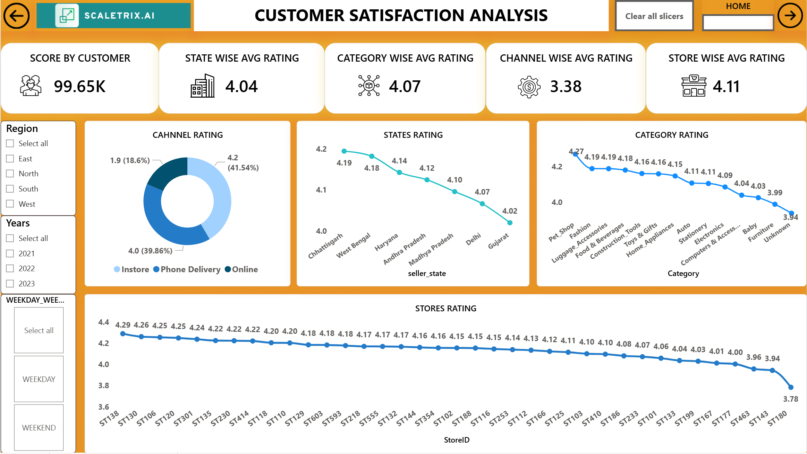

# End-To-End-Retail-Analysis.-Sql-Power-BI-

# 🛍️ Retail Sales Analysis Dashboard

## 📈 Dashboard Preview







## 📌 Project Overview
This project is an **end-to-end retail data analytics solution** designed to provide actionable insights into **sales, customer behavior, and store performance**.  
It integrates **SQL for data cleaning & processing**, **Python for advanced analysis**, and **Power BI for interactive dashboards**.

The analysis covers:
- **Sales by time dimension** (day, week, month, quarter)
- **Weekday vs. weekend sales comparison**
- **Top-performing products and stores**
- **Customer purchasing patterns**
- **Cancellations & net units sold**

---

## 🎯 Objectives
- Clean and prepare raw retail data from multiple sources.
- Build calculated measures (Net Units, Cancelled Units, Repeat Purchase Rate).
- Identify **sales trends, seasonality, and performance gaps**.
- Create an **interactive dashboard** for stakeholders to explore insights.

---

## 🛠 Tools & Technologies
- **SQL (SSMS)** – Data cleaning, transformations, KPI calculation
- **Python (Pandas, NumPy, Matplotlib)** – Additional data analysis
- **Power BI** – Interactive dashboard creation
- **Excel** – Data validation & storage

---

## 📂 Dataset
The dataset consists of 4 main tables:
1. **Order360** – Orders with billing date, units, revenue
2. **Customer360** – Customer demographics & IDs
3. **Store360** – Store location & performance data
4. **Product360** – Product categories, pricing, and details

---

## 🔍 Methodology
1. **Data Cleaning**  
   - Removed missing values in key columns (PinCode, City Tier).
   - Converted mixed date formats using `TRY_CAST` in SQL.
   - Resolved duplicates and ensured data type consistency.

2. **Feature Engineering**  
   - Created calculated columns:
     - `Net_units = Units - Cancelled_units`
     - `OrderDayOfWeek`
     - `OrderWeekStart`
     - `Repeat Purchase Rate`

3. **Exploratory Data Analysis (EDA)**  
   - Sales trends by **day, week, month, quarter**.
   - Weekday vs. weekend performance.
   - Top 10 products & customers by revenue.
     
4. **Dashboard Creation**  
   - Built **interactive Power BI visuals** for executives.
   - Enabled dynamic filtering by **time, region, store, product**.

---

## 📊 Key Insights
- **Weekdays outperform weekends** by ~18% in revenue.
- **Quarter 4** shows a **32% increase** in sales compared to Quarter 1.
- Top 10% of customers contribute to **~40% of total revenue**.
- Stores in **Tier-1 cities** outperform Tier-2 & Tier-3 stores by 25%.

---


---

## 📌 How to Use
1. Clone the repository:
   ```bash
   git clone https://github.com/YourUsername/retail-sales-analysis.git
